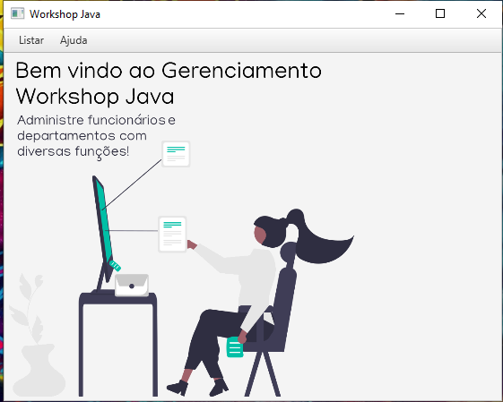

# JDBC-FX - Gerenciador de Departamentos e Funcionários

O JDBC-FX é um aplicativo desenvolvido em JavaFX e JDBC para gerenciar departamentos e funcionários. Ele permite adicionar, alterar, excluir e buscar funcionários ou departamentos. Além disso, o programa calcula automaticamente a receita do departamento de cada funcionário. Quando um funcionário é adicionado ou seu salário é alterado, o valor da receita do departamento é automaticamente atualizado.

## Funcionalidades

- **Gerenciamento de Funcionários:**
  - Adicionar, alterar, excluir e buscar funcionários.
  - Calcular automaticamente a receita do departamento quando um funcionário é adicionado ou seu salário é alterado.

- **Gerenciamento de Departamentos:**
  - Adicionar, alterar, excluir e buscar departamentos.

## Tecnologias Utilizadas

- **Frontend:** JavaFX
- **Backend:** JDBC (Java Database Connectivity)

## Configuração do Ambiente de Desenvolvimento

### Configuração do JDBC:

1. **Instale o MySQL:**
   - Baixe e instale o MySQL a partir do [site oficial](https://dev.mysql.com/downloads/mysql/).
   - Durante a instalação, assegure-se de instalar o conector JDBC.

2. **Execute o Script do Banco de Dados:**
   - Execute o script disponível em `jdbc-fx.sql` no MySQL para criar o banco de dados e as tabelas necessárias.

3. **Configuração no Eclipse:**
   - Crie uma nova user library com nome "MySQL" no Eclipse.
   - Importe os jars do MySQL disponíveis em `./dist/JDBC-fx_lib`.

4. **Instale o Plug-in E(fx)clipse:**
   - Instale o plug-in E(fx)clipse no Eclipse para suporte ao desenvolvimento JavaFX.

### Configuração do JavaFX:

1. **Configuração no Eclipse:**
   - Crie uma nova user library com nome "JavaFX" no Eclipse.
   - Importe os jars do JavaFX disponíveis em `./dist/JDBC-fx_lib`.

2. **Instale o Plug-in E(fx)clipse:**
   - Instale o plug-in E(fx)clipse no Eclipse para suporte ao desenvolvimento JavaFX.

## Padrão de Projeto

O projeto segue o padrão DAO (Data Access Object) com o uso de Singleton para garantir que apenas uma instância da classe de acesso a dados seja criada durante toda a execução do programa.

## Executando o Aplicativo

- Compile o código-fonte no Eclipse.
- Execute o programa a partir do Eclipse.

## Contribuição

Contribuições são bem-vindas! Sinta-se à vontade para abrir uma issue ou enviar um pull request.

## Licença

Este projeto é licenciado sob a Licença [MIT](https://opensource.org/licenses/MIT).
